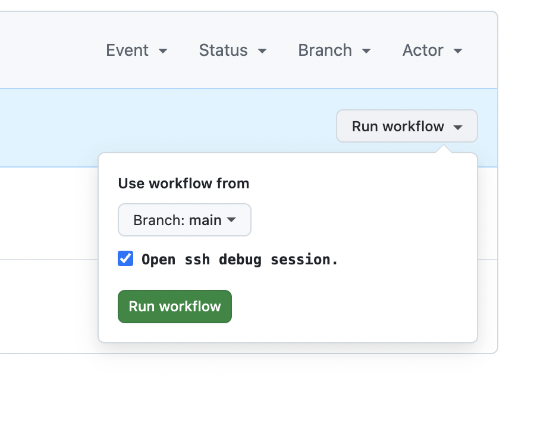

# poetry_env_bug

DEMO of [this poetry bug](https://github.com/python-poetry/poetry/issues/10186).

You can turn on an ssh debug session by going to the [actions page](https://github.com/bckohan/poetry_env_bug/actions/workflows/test.yml) and clicking on debug in the run workflow dropdown:

